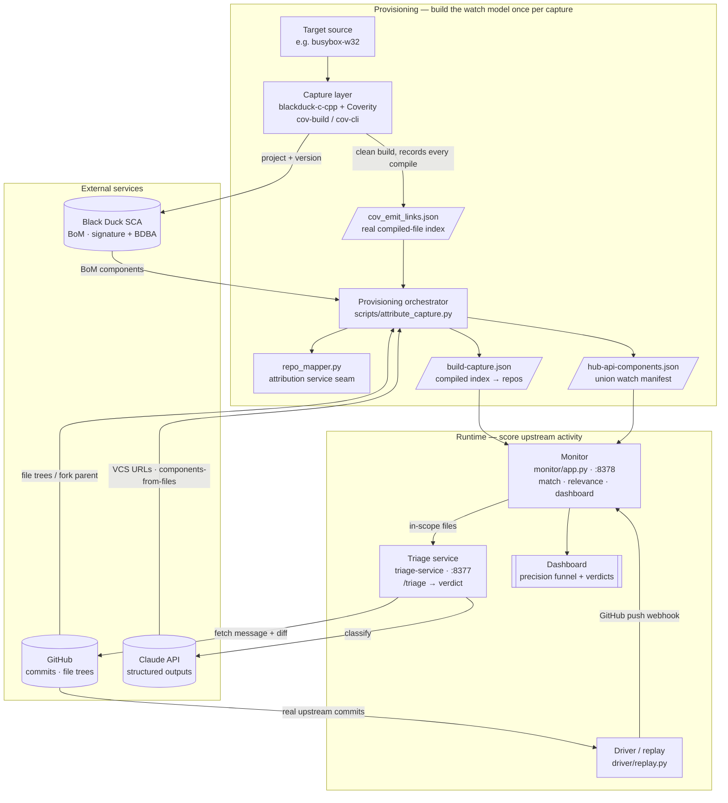

# Architecture

RepoMonitoring is a **patch-gap monitor**: it watches the upstream repositories
that feed an embedded/native build and, when an upstream commit lands, decides
whether it is a quiet security fix the product needs to absorb — versus routine
churn. The system is deliberately split into small, replaceable services joined
by plain JSON artifacts and HTTP, so any one stage (the capture engine, the
attribution rule, the triage brain) can be swapped without touching the others.

There are two phases: a **provisioning** phase that builds the *watch model* from
a real build, and a **runtime** phase that scores upstream activity against it.

---

## The two phases at a glance



---

## Components

| Component | Role | Tech / interface |
|---|---|---|
| **Capture layer** | Builds the target *from source* and records exactly which translation units actually compiled; uploads the project + BoM to Black Duck. This is the ground truth of "what is really in this build." | `blackduck-c-cpp` wrapping Coverity `cov-build`/`cov-cli`. Emits `cov_emit_links.json`. |
| **Black Duck SCA** *(external)* | Content-identity of components in the build (signature/Knowledge-Base + BDBA binary matching) → the Bill of Materials. | REST; token auth. Field-test instance. |
| **Provisioning orchestrator** | Fuses the signals below into the monitor's two input artifacts. **Monitored ⇔ a repo owns ≥1 primary translation unit** actually compiled; SBOM entries with no compiled source are *reference-only*. | `scripts/attribute_capture.py`. |
| ↳ **repo_mapper** | The compiled-file → repository **attribution service** (a swappable seam). Today: longest-suffix; this is where fork / vendored-copy disambiguation evolves. | `scripts/repo_mapper.py` — `attribute(compiled_paths, repo_filesets)`. |
| ↳ **bd_provision** | Pulls the live BoM and resolves each component's upstream VCS URL (the BoM endpoint does not serve it) via a Claude structured call. | `scripts/bd_provision.py`. |
| ↳ **gh_replay** | Fetches *real* recent commits per watched repo (on the correct maintenance branch) and a source-file index at the release tag. | `scripts/gh_replay.py`. |
| **Monitor** | Loads `build-capture.json` + `hub-api-components.json` per project; receives push webhooks; matches changed files to the compiled set; short-circuits reference-only repos; calls triage on in-scope commits; renders the dashboard. Multi-project (1 data-dir = 1 BD project). | `monitor/app.py`, HTTP `:8378` — `POST /webhook`, `GET /`, `GET /health`. |
| **Triage service** | Given `{vcs_url, commit, files}`, returns one verdict. Live backend fetches the commit message + diff from GitHub, asks Claude for a structured verdict, and caches input+output; a deterministic truth-table **stub** is the offline fallback. | `triage-service/claude_server.py` (live) / `server.py` (stub), HTTP `:8377` — `POST /triage`. |
| **Driver / replay** | Turns recorded commit events into standard GitHub push payloads and delivers them to the monitor — simulating upstream activity for a demo, or replaying a captured event stream. | `driver/replay.py`. |
| **Claude API** *(external)* | Two illustrative uses: (1) provisioning — resolve VCS URLs and reconstruct components from compiled paths; (2) runtime — triage a commit into a verdict. | Structured outputs (`messages.parse`). |
| **GitHub** *(external)* | Source of upstream commits, file trees, and fork-parent links. | REST via `gh auth token`. |

## Data artifacts (the contracts between stages)

| Artifact | Produced by | Consumed by | Meaning |
|---|---|---|---|
| `cov_emit_links.json` | Capture layer | orchestrator | Every translation unit + input file the build actually compiled. |
| `build-capture.json` | orchestrator | monitor | Compiled files attributed to canonical repos + the monitored repo set. |
| `hub-api-components.json` | orchestrator | monitor | Union watch manifest (BD BoM ∪ Claude-from-files ∪ `.git` checkouts), each tagged with its version source. |
| `*-commit-events.json` | gh_replay | driver | Real upstream commits to replay. |
| `triage-cache/` | triage service | triage service | Persisted verdicts keyed by `{vcs_url, commit, sorted(files)}` — repeat runs are free. |

---

## How attribution decides what to monitor

The orchestrator never assumes files are tidily arranged by component (if they
were, you wouldn't need SCA). It takes the **union of three independent signals**
so it never under-approximates the watch set:

1. **Black Duck BoM** — content identity from signature + BDBA.
2. **Claude-from-compiled-files** — a second content identity, inferred from the
   compiled file paths.
3. **`.git` discovery** — ground truth: a compiled file inside a checkout *is*
   that repo's code; the checkout's `origin` (resolved through its GitHub
   fork-parent to the **canonical** upstream) says where it came from.

A repo is **monitored** only if it owns at least one *primary* translation unit
that was compiled. Owning only `#include`d headers (e.g. an OpenSSL the build
merely links) makes it **reference-only** — shown for transparency, never
watched. For a forked or vendored copy we monitor the **canonical upstream**, not
the local copy, because security patches land upstream; the local copy is
recorded as *divergent provenance*, not a second watch target.

## How runtime scores a commit

For each changed file in a push, the monitor matches against the compiled set in
tiers: **exact relative path** (confidence 1.0) → **≥2 trailing path segments**
(0.8) → **basename only** (0.5). If nothing matches, the commit is `suppressed`
(not in this build's compiled set). If something matches, the in-scope files go
to triage, which returns one of:

- **`response_required`** — security-relevant to *this* build (with an urgency).
- **`needs_human_review`** — plausibly relevant but ambiguous.
- **`not_meaningful`** — refactor / rename / docs / test-only, no security bearing.

The dashboard presents this as a **precision funnel** — SBOM (recall) → compiled
(precision) → monitored vs reference-only — plus the live verdict stream.

**OSV cross-check (ground truth on the triage).** On demand, each event's commit
is checked against OSV.dev: query the commit's *parent* for the vulnerabilities
still affecting it, then look for the event commit among the returned records'
GIT-range `fixed` events — an exact-sha match means "this commit is a published
CVE fix" straight from the advisory database. No LLM anywhere in the path (local
git + one HTTPS query, CVSS computed from the vector, verdicts cached in redis),
so it grades the triage independently: a `response_required` on a known CVE fix
is corroborated, a `not_meaningful` is a flagged miss, and a `suppressed` CVE fix
shows the scope filter excluding a patch that touched files outside the compiled
set (e.g. a MiniZip fix in a build that never compiles `contrib/`).

---

## Honesty / design notes

- **The LLM calls are illustrative, not load-bearing.** A production system would
  have the SCA Knowledge Base resolve-and-store VCS URLs once, not call an LLM per
  run; triage quality/latency depends on the model chosen. Both are isolated
  behind service boundaries so they can be replaced.
- **`repo_mapper` is the priority evolution point.** Longest-suffix is a
  placeholder; fork-vs-upstream and vendored-copy disambiguation is the first
  objection a real audience raises, and it lives entirely behind that one seam.
- **The offline path stays dependency-free.** The core demo (`samples/` + the
  stub triage truth-table) runs on the Python standard library alone; live mode
  (real capture, Black Duck, Claude, GitHub) is strictly additive.
```
