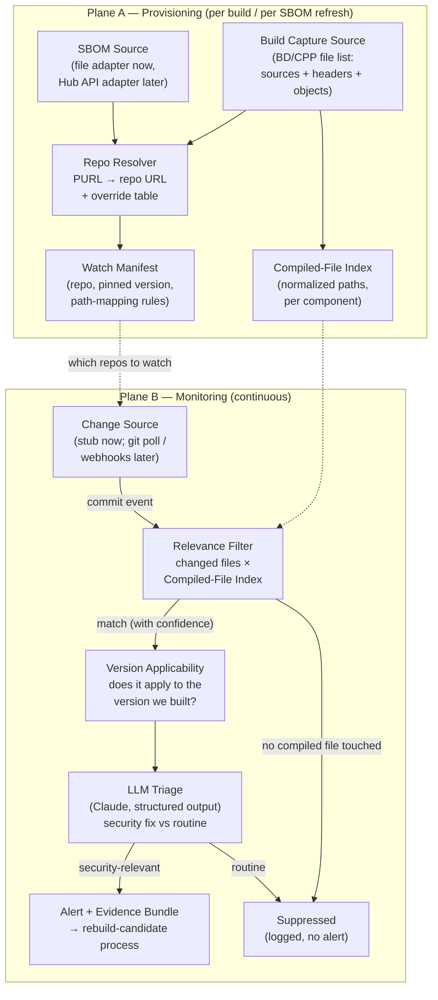

# RepoMonitoring — Design

## Purpose

Defensive patch-gap monitoring for vendors who build full operating systems from
source (Yocto, Buildroot, and similar). Attackers derive exploits from the merge
requests that fix vulnerabilities — often before a CVE exists — faster than
embedded vendors can rebuild. This tool watches the upstream repos that actually
feed a vendor's build, flags commits that look like quiet security fixes, and
suppresses noise about code the device never shipped, so the vendor can start a
candidate rebuild before an N-day lands.

Scope is **urgency triage only**: classify "likely security fix vs. routine
change." The tool never derives or assists in deriving exploits.

## Differentiated insight

Precision comes from observing the **real build**, not declared dependencies:

- **Recall** (never miss a repo): SBOM from a traditional SCA tool, merged with
  build-observation component matches.
- **Precision** (never false-alarm): every upstream change is cross-referenced
  against the set of files (sources **and headers**) that were actually
  compiled. Example: a kernel driver fix for hardware the device doesn't have —
  the repo is monitored, but the file isn't in the compiled set, so no alert.

Component identification is delegated to existing tooling — we do not reinvent it:

- **BD/CPP** (`blackduck-c-cpp`, Coverity Build Capture): wraps the build,
  records paths of all compiled sources, **included headers**, and linked
  objects; matches them to components via package-manager queries, file
  content/signatures, and BDBA binary matching. Header capture solves the
  "security fix lands in a `.h`" false-negative class for free.
- **Traditional SCA** (Black Duck Hub): produces the SBOM, including build
  metadata extraction.

## Architecture

Two planes. **Provisioning** runs once per build (and re-runs whenever the SBOM
changes — the SBOM is not assumed stable). **Monitoring** runs continuously.



## Components

### SBOM Source (interface: `SBOMSource`)
- **Prototype:** `FileSBOMSource` — reads a CycloneDX (or SPDX) document from disk.
  Demo uses hand-crafted sample data with fictitious components.
- **Production:** `HubAPISBOMSource` — pulls the live BOM from Black Duck Hub.
  Required because the SBOM changes; a manually exported file goes stale.
  Provisioning re-runs on SBOM change and diffs the Watch Manifest.
- Normalized internal model keyed by PURL: `Component {purl, name, version, source_refs}`.

### Build Capture Source (interface: `BuildCaptureSource`)
- **Prototype:** reads a JSON file emulating BD/CPP output. The capture phase
  emits everything resolvable from the build host at capture time:
  - `files`: `{path, kind: source|header|object, component, resolution}` —
    files owned by the system package manager (dpkg/apt) are resolved to a
    component during capture; the rest defer to SCA-side matching.
  - `repos_detected`: every VCS URL discoverable on disk during the same scan
    — `.git` remotes and build-system metadata (`SRC_URI`), with pinned refs.
    Local forks and upstream remotes are both emitted (duplication expected);
    reconciliation is the SCA side's job, out of scope here. Monitoring
    watches both — fixes land upstream first, the fork is what gets built.
- **Production:** consumes actual BD/CPP artifacts / Hub matched-file data.

### Repo Resolver
Maps each component to the upstream repo where fix commits appear.
Resolution chain, each step recording a confidence and provenance:
1. PURL with direct VCS info (`pkg:github/...`, `vcs` external reference).
2. Build-observation evidence (walk-up `.git` discovery, BD/CPP match metadata).
3. Ecosystem lookup (deps.dev / Repology / OSV) — handles the tarball-fetched
   "code disconnected from repo" case by mapping release tarballs to the
   upstream development repo.
4. Manual override table (`overrides.yaml`) for the long tail.

Output per component: `{repo_url, branches_to_watch, pinned_ref_or_version, confidence}`.
Branches: default branch + nearest stable/release branch to the built version
(fixes land on master first, then get backported — we want both signals).

### Watch Manifest + Compiled-File Index (state)
SQLite for the prototype. Tables: `components`, `repos`, `compiled_files`,
`commit_events`, `triage_results`. The Compiled-File Index stores normalized
paths (build-sysroot and component-root prefixes stripped) for suffix matching.

### Change Source (interface: `ChangeSource`)
Emits commit events: repo URL, branch ref, commit hash, changed-file paths.
- **Prototype:** the monitoring web app (`monitor/app.py`) exposes
  `POST /webhook` accepting the Git webhook standard (GitHub push-event
  format: `ref`, `repository.clone_url`, `commits[].id/added/modified/
  removed`). A driver script replays the sample events from
  `samples/commit-events.json` against it — the demo's "we just hit the
  monitoring tool and it detected a change" lever: replayable, no upstream
  auth, no rate limits, no waiting for real commits.
- **Production:** real forge webhooks land on the same endpoint; git polling
  (`fetch` + `log` since last-seen sha) feeds the same processing path for
  legacy repos. Transport is invisible to the user either way.

### Relevance Filter
**The commit hash is the unit of selection and triage.** A commit is
*selected* iff at least one of its changed files matches the compiled set;
all in-scope files of a selected commit are evaluated **together**, producing
a single verdict per commit hash (e.g., a fix spanning `dhcpc.c` and
`packet.c` is one triage call, not two).

For each changed file in the event, match against the Compiled-File Index:

| Tier | Rule | Confidence |
|---|---|---|
| 1 | Exact normalized relative path | 1.0 |
| 2 | Path-suffix match, ≥2 trailing segments | 0.8 |
| 3 | Basename match + size/content similarity | 0.5 |

Tolerance is widened for files the build patched downstream (recipe `.patch`
lists tell us which files diverge from upstream). Events with no match above
threshold are **suppressed but logged** — the kernel-driver-not-in-config case.

### Version Applicability
Does the change apply to what we built? Prototype: the matched file exists at
the pinned version and the commit's branch is upstream of (or a backport
branch for) the pinned ref — recorded as a flag on the event, not a hard gate.
Production: hunk-overlap check against the file content at the pinned `SRCREV`.

### Triage Engine (interface: `TriageEngine`)
Every commit that survives the Relevance Filter goes to triage — no rules
pre-filter (decision: simplest pipeline; the engine sees everything that
matched the compiled set).

- **Prototype:** `StubTriage` — a small HTTP service
  (`triage-service/server.py`) that accepts `POST /triage` with
  `{vcs_url, commit, files}` and returns a verdict from a deterministic truth
  table keyed by commit hash (`samples/triage-verdicts.json`). One request per
  selected commit; in-scope files evaluated together. Unknown commits fail
  safe to `needs_human_review`. Rationale: a demo must be repeatable; live
  LLM calls waste tokens and are non-deterministic. The service returns the
  same schema the real engine will, so the pipeline and demo narrative are
  identical either way — production swaps the truth table for a Claude call
  behind the same endpoint.
- **Production:** `ClaudeTriage` — `claude-opus-4-8` ($5 / $25 per MTok) via
  `client.messages.parse()` with the same Pydantic schema. A triage call
  (commit message + diff + component context, ~2–5K input tokens, ~500 output
  tokens) costs well under a cent; the Batches API gives 50% off for
  non-latency-sensitive backlogs if volume grows.
- **Shared output schema:**

```python
class TriageResult(BaseModel):
    verdict: Literal[
        "not_meaningful",        # no security relevance to this build
        "needs_human_review",    # ambiguous — route to the human queue
        "response_required",     # definite: start the rebuild-candidate process
    ]
    rationale: str                       # LLM-generated reasoning behind the verdict
                                         # (simulated/canned in the prototype stub)
    urgency: Literal["critical", "high", "medium", "low"] | None  # set when response_required
    vulnerability_class: str | None      # e.g. "out-of-bounds write" — descriptive only
    reachability_notes: str | None       # e.g. "parser reachable from network input"
    recommended_action: str              # e.g. "start candidate rebuild and regression test"
```

Every verdict — including `not_meaningful` — carries reasoning, so the human
queue and the audit log always show *why* the engine decided what it did.

- **Signals the production prompt will direct attention to:** quiet input-validation additions,
  bounds/length checks, integer-overflow guards, memory-safety idioms
  (`memset`, freed-pointer nulling), sanitizer-style fixes, security-adjacent
  files (parsers, protocol handlers, crypto), commit-message tells (or their
  conspicuous absence — silent fixes are the interesting ones), CVE/advisory
  references for dedup against already-public issues.
- **Scope guard in the production system prompt:** classify and explain
  urgency only; never produce exploitation guidance. Output language mirrors
  public CVE/advisory norms.

### Alert / Evidence Bundle
Markdown (and optionally HTML) report per security-relevant commit: component,
commit link, matched compiled files with confidence tier, version-applicability
flag, triage classification + rationale, recommended action. This is the
artifact that kicks off the vendor's rebuild-candidate process.

## Demo script (replayable, fictitious data)

Sample inputs ship in `samples/`: SBOMs in three formats, a BD/CPP-style
capture (files + detected repos), commit events, and the triage truth table.
Two local services run during the demo: the triage stub
(`python triage-service/server.py`, port 8377) and the monitoring component
(`python monitor/app.py`, port 8378) with its dashboard at
`http://127.0.0.1:8378/`. "Inject event" below means the driver POSTs the
sample commit as a push webhook to the monitor. The narrative:

1. `provision` with an SBOM (any of the three formats) +
   `samples/build-capture.json` — show the Watch Manifest: repos (including
   the fork/upstream pair), pinned versions, resolution provenance.
2. `inject-event evt-001` — a quiet parser fix touching **two** in-scope
   BusyBox files in one commit → selected, both files evaluated together in
   one triage call → verdict **response_required** with simulated LLM
   rationale.
3. `inject-event evt-002` — a real fix in a wireless driver the GW-7100
   never builds → no in-scope files, commit **not selected**; suppressed
   before triage, log shows why. (The precision story — this is the slide
   that differentiates from CVE feeds.)
4. `inject-event evt-003` — an ambiguous pointer-handling change in
   `net/core/skbuff.c` → verdict **needs_human_review**, queued with
   simulated rationale explaining the ambiguity. (Matches the rollout plan:
   human triage first, agentic later.)
5. `inject-event evt-004` — a rename/refactor in a compiled zlib file →
   verdict **not_meaningful**, no alert, rationale logged.

The demo is fully deterministic end to end: stubbed change source, stubbed
triage, fixed sample data. No network access, no API keys, no token spend.

## Prototype stack

- Python 3.12, single package, CLI via `argparse` (or `typer`): `provision`,
  `inject-event`, `report`, `list-watches`.
- SQLite state, Pydantic models throughout. The `anthropic` SDK is not a
  prototype dependency — it arrives with `ClaudeTriage`.
- Zero network access for the demo: no API keys, no token spend, no
  non-determinism.

## Long-term vision: Black Duck SCA integration

This does not stay standalone — it needs vendor adoption, and Black Duck SCA is
the natural home because BD/CPP **already submits the complete compiled-file
list to the Hub** as part of normal operation. The envisioned shape:

- The monitoring tool deploys as **one additional container** in a standard
  BD SCA deployment.
- Whenever a new build is analyzed with BD/CPP, the repo list is recomputed and
  a **push notification** goes to the monitoring container, which adjusts the
  watch lists for that project (repos added/dropped/re-pinned, compiled-file
  index refreshed). Webhooks for modern forges, polling for legacy repos —
  invisible to the user.
- On a detected change, the workflow runs (relevance filter → version check →
  triage) and ends in a **notification** that kicks off the customer's
  rebuild-candidate process.

The vision deck lives in `slides/` (`gen_slides.py` regenerates
`RepoMonitoring-Vision.pptx`); the prototype demonstrates the pipeline.

## Deliberately deferred (interfaces already in place)

> Live prototypes for the first two now exist under `scripts/` (see
> `DEMO.md` → *Live mode*): `bd_provision.py` pulls a real Black Duck BOM and
> resolves VCS URLs via a Claude call; `gh_replay.py` fetches real upstream
> commits and a source-file index. Both write cached artifacts the existing
> monitor/driver replay unchanged.

- Black Duck Hub API adapter (`SBOMSource`) — SBOM freshness at scale.
  *(Live prototype: `scripts/bd_provision.py`.)*
- Real git polling / webhook `ChangeSource`.
  *(Live prototype: `scripts/gh_replay.py` — fetch-and-cache, replayed offline.)*
- `ClaudeTriage` (`TriageEngine`) — live LLM triage replacing the truth-table stub.
  *(Next up — reuses the `client.messages.parse` pattern from `bd_provision.py`.)*
- Hunk-level version-applicability analysis at pinned `SRCREV`.
- Rules pre-filter ahead of the LLM (cost lever if volume grows).
- "Installed but not compiled" surface (scripts, configs, certs) via image
  manifests — keep the filter abstraction on "shipped", not "compiled".
- Human review queue / dashboard UI.
